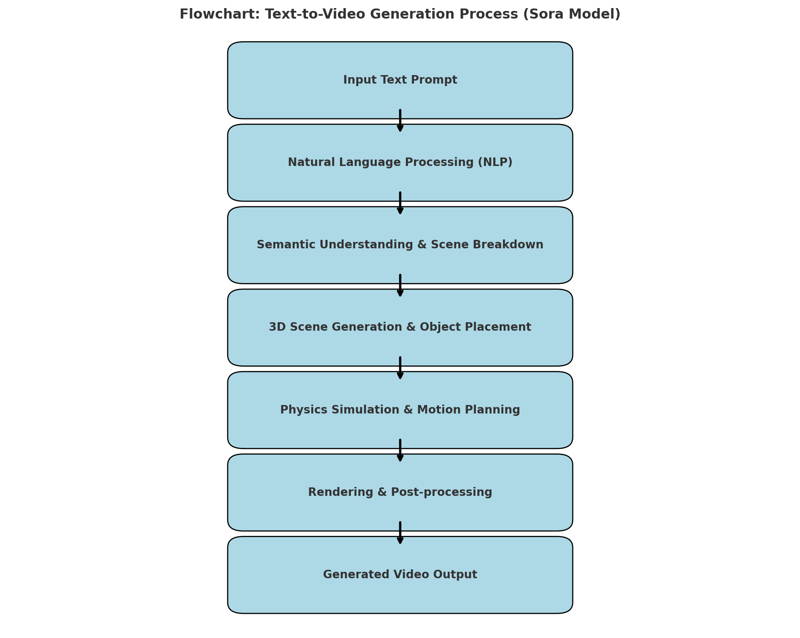

# What is SORA AI.

Sora is **OpenAL`s ** advanced text-to-video genration model.
- Released in December 2024
- highlights Generate video up to 1 minute length { High Visual Quality }
  - Text-to-video generation
  - Multimodal Inputs
  - High Quality Output
  - Creative Flexibility

  # Input Text to OUTPUT Video
  
  
## Now understand Step-by-step of the flow Diagram

# Natural Language Processing (NLP) for understanding and interpreting human language.
  - Understanding User Intent
  - Extract Semantic relationships
  - identify scene
  - captures the emotion tone
  - Multi-sentence, Contextual Consistency
  - Text to Structure Mapping

On Going Reseach on Mediacal Side:
1.  [Neurosurgery Applications](https://link.springer.com/article/10.1007/s10143-024-02514-w)
    Researchers have examined Sora's capabilities in neurosurgery, highlighting its potential in: 
  - Patient Education: Creating videos that elucidate complex neurosurgical procedures for patients.
  - Surgical Training and Planning: Developing realistic simulations to aid in surgical preparation and education.

2.  [Plastic Surgery Insights](https://link.springer.com/article/10.1007/s00266-024-04583-0?)
    In plastic surgery, Sora's ability to generate detailed human images has been explored for:
  - Preoperative Planning: Visualizing potential surgical outcomes based on textual descriptions.
  - Patient Consultations: Providing visual aids to help patients understand procedural results.

3. [General Medical Education](https://link.springer.com/article/10.1007/s11845-024-03680-y?)
    Sora's potential extends to broader medical education, where it can:
  - Create Educational Content: Generate videos that explain medical concepts, procedures, and patient care techniques.
  - Enhance Public Health Communication: Produce engaging content to disseminate health information to the public.
